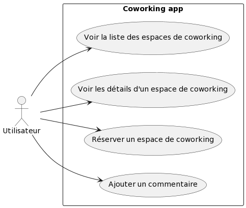
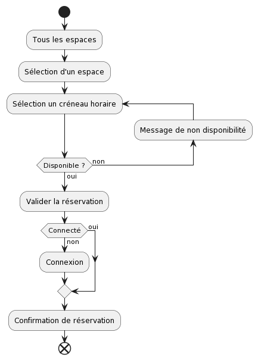
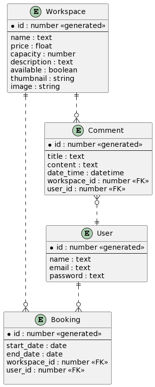
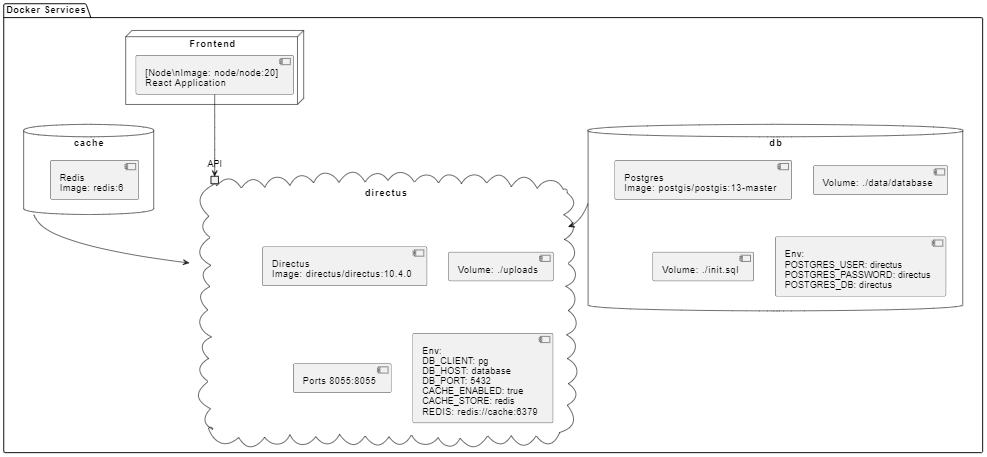

# Cahier des Charges Fonctionnel (CDCF)

## Présentation du Projet

Le projet consiste à créer une application web pour la gestion des espaces de coworking. Cette application permettra aux utilisateurs de visualiser la liste des espaces de coworking, voir les détails d'un espace spécifique, y compris les commentaires des autres utilisateurs, ajouter leurs propres commentaires, vérifier la disponibilité d'un espace et effectuer une réservation.

## Besoins et Objectifs

**Besoins Identifiés :**

- Les utilisateurs ont besoin d'un moyen simple et efficace pour trouver des espaces de coworking.
- Les utilisateurs ont besoin de voir les détails d'un espace de coworking, y compris les commentaires des autres utilisateurs.
- Les utilisateurs ont besoin de pouvoir ajouter leurs propres commentaires sur un espace de coworking.
- Les utilisateurs ont besoin de vérifier la disponibilité d'un espace de coworking.
- Les utilisateurs ont besoin de pouvoir réserver un espace de coworking.

**Objectifs du Projet :**

- Fournir une interface utilisateur simple et intuitive.
- Permettre aux utilisateurs de visualiser la liste des espaces de coworking.
- Permettre aux utilisateurs de voir les détails d'un espace de coworking, y compris les commentaires des autres utilisateurs.
- Permettre aux utilisateurs d'ajouter leurs propres commentaires sur un espace de coworking.
- Permettre aux utilisateurs de vérifier la disponibilité d'un espace de coworking.
- Permettre aux utilisateurs de réserver un espace de coworking.

## Fonctionnalités du Projet

**Spécifications Fonctionnelles :**

1. **Visualiser la Liste des Espaces de Coworking :**
   - Les utilisateurs peuvent visualiser une liste de tous les espaces de coworking disponibles.
2. **Voir les Détails d'un Espace de Coworking :**
   - Les utilisateurs peuvent sélectionner un espace de coworking spécifique pour voir plus de détails, y compris les commentaires des autres utilisateurs.
3. **Ajouter un Commentaire :**
   - Les utilisateurs peuvent ajouter leurs propres commentaires sur un espace de coworking spécifique.
4. **Vérifier la Disponibilité d'un Espace de Coworking :**
   - Les utilisateurs peuvent vérifier la disponibilité d'un espace de coworking spécifique.
5. **Réserver un Espace de Coworking :**
   - Les utilisateurs peuvent réserver un espace de coworking spécifique.

**MVP (Minimum Viable Product) :**

- Le MVP de ce projet comprendra les fonctionnalités suivantes :
  1.  Visualiser la liste des espaces de coworking.
  2.  Voir les détails d'un espace de coworking, y compris les commentaires des autres utilisateurs.
  3.  La possibilité de créer un compte et de s'authentifier.
  4.  Ajouter un commentaire sur un espace de coworking.
  5.  Vérifier la disponibilité d'un espace de coworking.
  6.  Réserver un espace de coworking.

**Évolutions Potentielles :**

- Les évolutions potentielles du projet qui ne font pas partie du MVP incluent :
  1.  La possibilité pour les utilisateurs de modifier ou de supprimer leurs propres commentaires.
  2.  La possibilité pour les administrateurs de gérer les espaces de coworking, y compris l'ajout, la modification et la suppression d'espaces.
  3.  Possibilité pour les utilisateurs de noter les espaces de coworking.
  4.  Recherche et filtrage des espaces de coworking.

## Cible du Projet

- Le public cible de ce projet sont les professionnels, les freelances et les entreprises qui cherchent à réserver des espaces de coworking.

## Arborescence de l'Application

1. **Page d'Accueil :**
   - Présentation du site.
2. **Page Liste des Coworkings :**
   - Listing des coworkings et de leur descriptif
3. **Page de Détails d'un Espace de Coworking :**
   - Détails de l'espace de coworking sélectionné, y compris les commentaires des autres utilisateurs.

## Liste des User Stories

| User Story | En tant que... | Je veux...                                                            | Afin de...                                                    |
| ---------- | -------------- | --------------------------------------------------------------------- | ------------------------------------------------------------- |
| 1          | Utilisateur    | pouvoir visualiser la présentation du site                            | depuis la page d'accueil.                                     |
| 1          | Utilisateur    | pouvoir visualiser la liste des espaces de coworking                  | depuis la page Liste des coworking.                           |
| 2          | Utilisateur    | pouvoir sélectionner un espace de coworking spécifique                | depuis la page Liste des coworking pour voir plus de détails. |
| 3          | Utilisateur    | pouvoir ajouter un commentaire sur un espace de coworking spécifique  | depuis la page de détails de cet espace.                      |
| 4          | Utilisateur    | pouvoir vérifier la disponibilité d'un espace de coworking spécifique | depuis la page de détails de cet espace.                      |
| 5          | Utilisateur    | pouvoir réserver un espace de coworking spécifique                    | depuis la page de détails de cet espace.                      |

## Use cases

```uml
@startuml
left to right direction

actor Utilisateur as utilisateur

rectangle "Coworking app" {
usecase "Voir la liste des espaces de coworking" as UC1
usecase "Voir les détails d'un espace de coworking" as UC2
usecase "Réserver un espace de coworking" as UC3
usecase "Ajouter un commentaire" as UC4
}

utilisateur --> UC1
utilisateur --> UC2
utilisateur --> UC3
utilisateur --> UC4
@enduml
```



## Diagramme d'activité

Parcours d'un client de l'entrée sur le site jusqu'à la réservation

```uml
@startuml

start
:Tous les espaces;
:Sélection d'un espace;
repeat :Sélection un créneau horaire;
backward:Message de non disponibilité;
repeat while (Disponible ?) is (non) not (oui)
:Valider la réservation;
if (Connecté) then (non)
   :Connexion;
else (oui)
endif
:Confirmation de réservation;
end

@enduml
```



## ERD

```uml
@startuml
' hide the spot
' hide circle

' avoid problems with angled crows feet
skinparam linetype ortho

entity "Comment" as comment {
  *id : number <<generated>>
  --
  title : text
  content : text
  date_time : datetime
  workspace_id : number <<FK>>
  user_id : number <<FK>>
}

entity "Workspace" as workspace {
  *id : number <<generated>>
  --
  name : text
  price : float
  capacity : number
  description : text
  available : boolean
}

entity "User" as user {
  *id : number <<generated>>
  --
  name : text
  email : text
  password : text
}

entity "Booking" as booking {
  *id : number <<generated>>
  --
  start_date : date
  end_date : date
  workspace_id : number <<FK>>
  user_id : number <<FK>>
}

workspace ||..o{ booking
booking }o..|| user
user ||..o{ comment
workspace ||..o{ comment
@enduml
```



## UML de la structure dockerisée

```uml
@startuml
package "Docker Services" {
   node "Frontend" {
      component frontend [
         [Node\nImage: node/node:20]
         React Application
      ]
   }

  database db {
      [Postgres\nImage: postgis/postgis:13-master]
      [Volume: ./data/database]
      [Volume: ./init.sql]
      [Env:\nPOSTGRES_USER: directus\nPOSTGRES_PASSWORD: directus\nPOSTGRES_DB: directus]
  }

  database cache {
      [Redis\nImage: redis:6]
  }

  cloud directus {
      [Directus\nImage: directus/directus:10.4.0]
      [Volume: ./uploads]
      [Ports 8055:8055]
      [Env:\nDB_CLIENT: pg\nDB_HOST: database\nDB_PORT: 5432\nCACHE_ENABLED: true\nCACHE_STORE: redis\nREDIS: redis://cache:6379]
      port API
  }

}

db --> directus
cache --> directus
frontend --> API
@enduml
```


